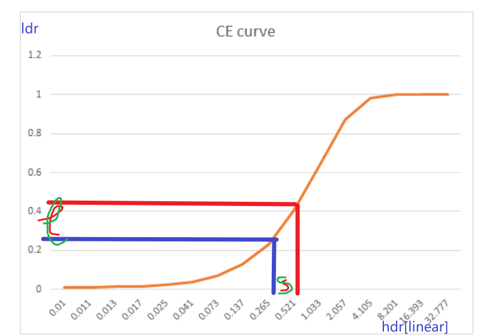

## HDR（linear） 2 LDR （SRGB）
Tonemapping（色调映射）是一种用于将高动态范围（HDR）图像转换为低动态范围（LDR）图像的技术。由于HDR图像包含更多的亮度信息，因此需要将其转换为LDR图像，以便在普通的显示设备上显示。  
Tonemapping技术可以帮助我们在保持图像质量和动态范围的同时，将HDR图像转换为LDR图像。  

  

## 技术原理
Tonemapping技术的原理是调整图像的亮度和对比度，以便在LDR范围内显示所有的细节和颜色。具体来说，Tonemapping技术主要包括以下几个步骤：   
1. 曝光调整：根据图像的亮度范围，调整曝光值，以提高整体的亮度或降低亮度。    
2. 映射函数：根据目标显示设备的亮度范围，选择合适的映射函数，以将HDR图像映射到LDR范围内。    
3. 压缩：将HDR图像中的亮度范围压缩到LDR范围内，以显示所有的细节和颜色。  
4. 色调调整：根据需要，对图像的色调进行调整，以改变图像的色彩风格。    

## 总结：    
总的来说，Tonemapping技术可以帮助我们将HDR图像转换为LDR图像，并在保持图像质量和动态范围的同时，显示所有的细节和颜色。Tonemapping技术广泛应用于电影、游戏以及其他数字媒体领域。  

## Tonemap曲线：
感觉和gamma矫正有大大的联系      

## 拷打：
### 为什么SR和Tonemapping一起做了
表面：因为cpp传给usf文件的东西都差不多的，那少传一次肯定减少很多耗时了  
实际：减少后处理drawcall的状态切换（感觉有点像SRP合批、静态动态合批什么的，都是为了少让CPU给GPU传东西），同时，也可以少创建一张用来绘制后处理完的结果的贴图     
引申：那为什么不干脆所有后处理都放tonemapping里 -》 已经放了，ue的tonemapping管线除了色调映射还开了好多宏做bloom什么的这种后处理   

### 为什么Tonemapping之前要用linear空间
~方便电脑计算~
因为blending，[看最后一部分](https://docs.unity3d.com/cn/current/Manual/LinearRendering-LinearOrGammaWorkflow.html)  
混合肯定是线性的计算，如果颜色用的不是linear而是gamma空间的SRGB的话，就是非线性的颜色用线性的混合式子算，会导致过度饱和和过亮混合
  
## 效果：

