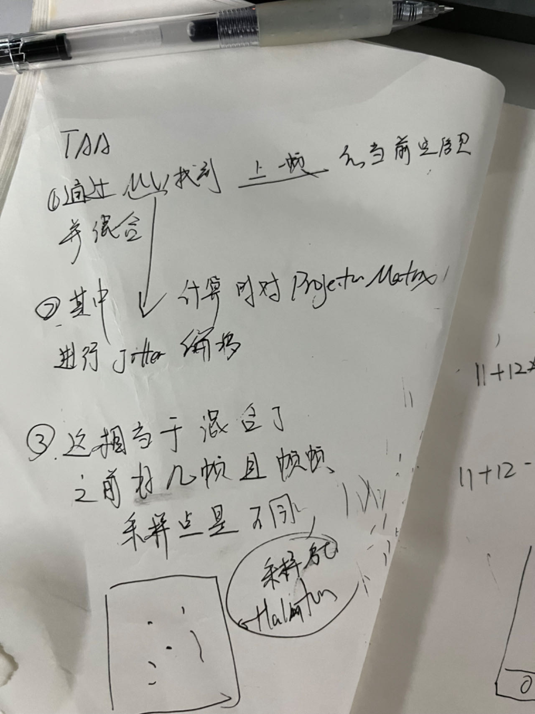

(https://zhuanlan.zhihu.com/p/46841906)
## 说明
那么复杂的算法居然直接可以被dlss优化
首先Temporal AA需要用到Motion Vector RT，Motion Vector是一个RGHalf（或RGFloat）的双通道贴图，储存的是当前像素点与上一帧的区别。
通过Motion Vector，找到上一帧的当前像素点的信息，然后混合，因为上一帧信息有很大概率还会出现在屏幕内。
同时，对投影矩阵进行半个像素距离的偏移，使得每一帧的投影矩阵与上一帧都不一样，也就相当于混合了多次采样的结果，实现超级采样，因此Temporal AA也称Temporal Super Sampler，通过抖动投影矩阵的做法被称为Jitter。

## 草图

