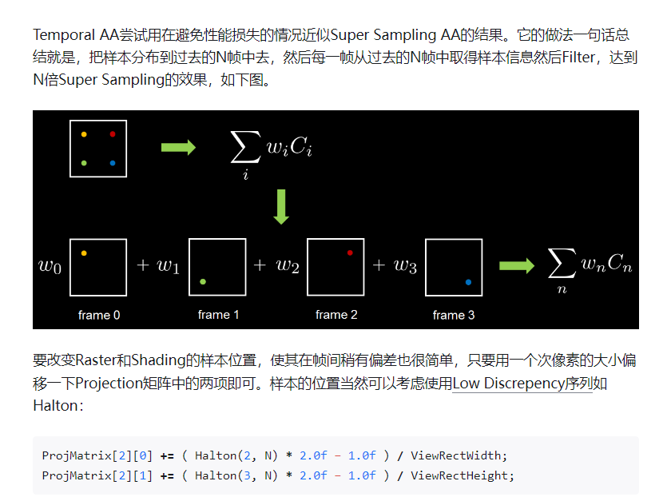

(https://zhuanlan.zhihu.com/p/46841906)
## 说明1.0
那么复杂的算法居然直接可以被dlss优化
首先Temporal AA需要用到Motion Vector RT，Motion Vector是一个RGHalf（或RGFloat）的双通道贴图，储存的是当前像素点与上一帧的区别。       
通过Motion Vector，找到上一帧的当前像素点的信息，然后混合，因为上一帧信息有很大概率还会出现在屏幕内。       
同时，对投影矩阵进行半个像素距离的偏移，使得每一帧的投影矩阵与上一帧都不一样，也就相当于混合了多次采样的结果，实现超级采样，因此Temporal AA也称Temporal Super Sampler，通过抖动投影矩阵的做法被称为Jitter。      

## 草图
  

## 说明2.0
感觉上面的说明只是孩子小不懂事写的  
核心在于下面，对于一个像素，通过抖动投影矩阵每帧采样当前像素内不同的采样点，然后每帧做累计平均，就相当于每帧采样了一个像素内的好几个点   
至于之前的MV贴图，只是因为像素在动所以要计算上，和TAA的核心思想没有半毛钱关系

## 链接
[如何解决鬼影问题](https://developer.download.nvidia.cn/gameworks/events/GDC2016/msalvi_temporal_supersampling.pdf)  
如果历史的像素值没有落在当前的像素的邻居构造的范围内，则不是consistent的，判断为需要另外处理，用下clip   
对于这个clip，一般把邻居的像素点放在RGB坐标系中，然后会有一个AABB包围盒，把在盒子里的当前像素值和盒子外的历史像素值连起来，得到被卡在盒子边上的点是clip的结果。然后链接里用方差构造了一个更好的AABB包围盒，称为variance clipping

